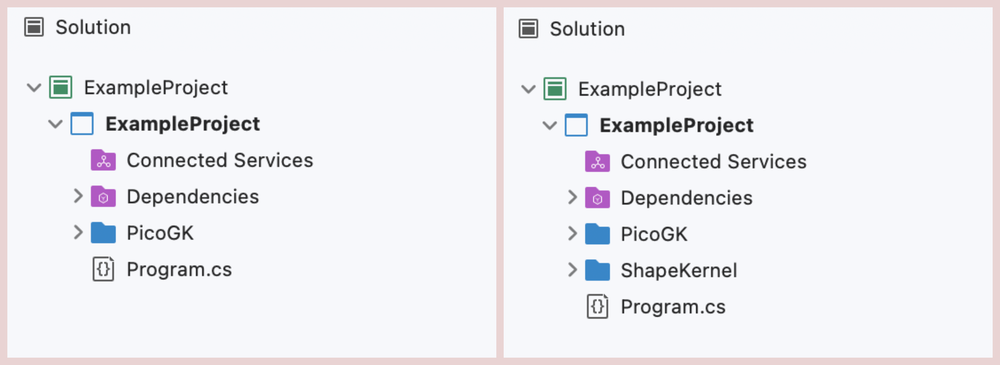

# Tutorial 1: ShapeKernel setup and running example tasks

## Prep

The LEAP 71 ShapeKernel library [uses PicoGK as the foundational Geometry Engine](https://github.com/leap71/PicoGK). Before going through this tutorial, make sure you were able to run the [example Task from PicoGK](https://github.com/leap71/PicoGK/blob/main/Documentation/README.md).


## Including the ShapeKernel library

At this point, your **Visual Studio (VS) project** should have a folder named PicoGK, holding the PicoGK library files and a "Program.cs". As a next step, we are adding the ShapeKernel library. This can be done in two ways:

- Beginner
  - download the ShapeKernel source code as zip file from https://github.com/leap71/LEAP71_ShapeKernel/releases/tag/v1.0.0 (you can pick the latest release available)
  - un-zip and copy the files into your VS project folder
- Pro
  - add ShapeKernel as a submodule, linking the Github repo: https://github.com/leap71/LEAP71_ShapeKernel




*(1) Project structure in VS before and after adding the ShapeKernel library.*


## Adding MathNet.Numerics NuGet Package

The ShapeKernel library relies on a few functions from the **MathNet.Numerics** NuGet Package. Chances are that this is not added to your VS project yet. If you try to run the code and you get the following error, you can simply add the package by clicking on the upper task bar:

- Tools > Manage NuGet Packages > Search: MathNet... > Add MathNet.Numerics


## Calling a new Task from Program.cs

You have run the `BooleanShowCase.Task` from the PicoGKExamples before. When the project is run and the PicoGK library is initialized, this **Task** function will be excuted. This means that the Task function is the entry point and all the code you want to run should be inside or called from within this function. 

Now, go into the Program.cs file and modify it to make it look like this by copying the code below:


```c#
using Leap71.ShapeKernel;
using PicoGK;

Console.WriteLine("Hello, World!");

string strOutputFolder = "/Users/josefinelissner/Documents/Code++/Examples";

try
{
    PicoGK.Library.Go(
        0.1f,
        Leap71.ShapeKernelExamples.BaseLensShowCase.Task,
        strOutputFolder
        );
    Library.Log("Finished Task successfully.");
}
catch (Exception e)
{
    Library.Log("Failed to run Task.");
    Library.Log(e.ToString());
    Library.oViewer().SetBackgroundColor(Cp.clrWarning);
}
```


We are changing four things here:

- Adding a dedicated output folder
- Changing the voxel size
- Calling an example task from the ShapeKernel library
- Wrapping a try-catch construct around the PicoGK library instantiation.


Per default, PicoGK will export STLs and write log files into your Documents folder. We recommend specifying a dedicated **output folder** (here `strOutputFolder`) for each project. Make sure, this folder already exists on your computer.

We are changing the **voxel size** from 0.5mm to 0.1mm to increase the resolution of the geometries that we are about to produce.

The ShapeKernel library comes with a number of example tasks that generate a few different variations of each BaseShape and showcase how implicits and lattices can be generated. In this case we are calling the `BaseLensShowCase.Task` which will generate a three variations of a type of BaseShape called BaseLens.


We are adding a try-catch construct around the PicoGK library instantiation in order to be able to read out the error message, should our code fail to run successfully. You can use this Program.cs as a template for all your projects, just update the output folder, pick an adequate voxel size and call the Task function that will be the entry point to your code.

Once you have run the first example successfully, feel free to go through the other Tasks, change the voxel size (sensible values are between 0.05mm and 1mm) and observe the impact. Using the [ShapeKernel documentation](README-ReadingDetails.md) you can dive into the code for the example tasks and start manipulating BaseShapes. Below is a list of example tasks to try out. You can find the code inside the Examples subfolder inside the ShapeKernel folder in your VS project.

- `Leap71.ShapeKernelExamples.BaseBoxShowCase.Task`
- `Leap71.ShapeKernelExamples.BaseCylinderShowCase.Task`
- `Leap71.ShapeKernelExamples.BaseLensShowCase.Task`
- `Leap71.ShapeKernelExamples.BasePipeShowCase.Task`
- `Leap71.ShapeKernelExamples.BasePipeSegmentShowCase.Task`
- `Leap71.ShapeKernelExamples.BaseRingShowCase.Task`
- `Leap71.ShapeKernelExamples.BaseSphereShowCase.Task`
- `Leap71.ShapeKernelExamples.BasicLattices.Task`
- `Leap71.ShapeKernelExamples.ImplicitGyroidSphere.Task`
- `Leap71.ShapeKernelExamples.LatticePipeShowCase.Task`
- `Leap71.ShapeKernelExamples.LatticeManifoldShowCase.Task`


*(1) Examples of different BaseShapes.*
