# ShapeKernel Documentation

## Nomenclature

Variable names typically contain a prefix that marks the data type of an object. This improves readability and makes developers aware of what kind of objects and classes they are dealing with. These are the commonly used data types:

- Floating point values start with f, e.g. `float fValue`
- Double precision floating point values start with d, e.g. `double dVolume`
- Integers start with i, e.g. `int iCounter`
- Unsigned Integers start with n, e.g. `uint nSamples`
- Vectors start with vec, e.g. `Vector3 vecPt`
- Lists / arrays start with a, e.g. `List<Vector3> aPoints`
- Structs start with s, e.g. `SProfile sProfile`
- Interfaces start with x, e.g. `ISpline xSpline`
- All other objects start with o, e.g. `InjectorElement oSwirler`

In addition to that, member variables inside a class are indicated this way:

- Member variable with m_, e.g. `float m_fMass`

There is also a convention for the common geometry data types:
- Lattices in a generic context are called `Lattice oLattice`, in a specific context they start with lat, e.g. `Lattice latPipes`
- Implicits in a generic context are called `IImplicit oImplicit`, in a specific context they start with sdf, e.g. `IImplicit sdfSphere`
- Voxels in a generic context are called `Voxels oVoxels`, in a specific context they start with vox, e.g. `Voxels voxMotor`

The same prefixes apply to functions that return an object of the above mentioned types. A function that returns a voxelfield would be called e.g. `voxUnion()`. A fuction that returns a vector would be called e.g. `vecRotate()`.

The ShapeKernel is implemented using the basic concepts of object-oriented programming (OOP), such as interfaces and inheritance from abstract parent classes. We recommend refreshing your memory regarding those principles as they will be just as useful for the engineering code.


## Ways to Create Geometries

### Voxels

Voxels describe a digital material distibution of an object within a regular 3D grid. You can picture it as a stack of black-and-white images, where a white pixel declares matter and a black pixel declares the absence of matter. Fields of Voxels are the most basic, and often native representation of the underlaying geometry kernels that we use. You will not create a field of Voxels by setting individual voxels, but by rendering other geometry data types into a field ("voxelizing"). Many subsequent functions (like `voxBoolean()`, `voxOffset()`, `voxSmoothen()`...) operate directly on Voxels. Inputs (e.g. STL files) will be rendered into voxels. Outputs (e.g. STL files, CLI slices, G-code or Image files...) are all derived from a voxelfield.


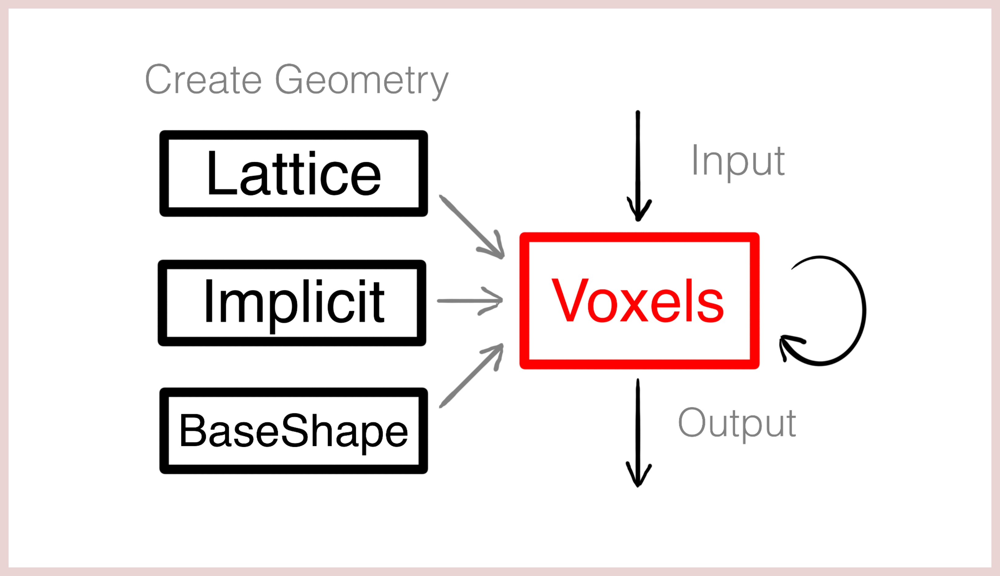

*(1) Workflow of creating Shapes.*


### Lattice

Lattices are the most basic way of creating a new shape. Such a lattice is an empty bucket to start with and as you go, you add Nodes or Beams to this bucket. Finally, you can render the lattice into voxels. This field of Voxels will represent the accumulated sum of all nodes and beams that were contained within the lattice object. Lattice nodes are small spheres with a 3D position and a radius. Beams have two points in space that are connected via a conical cylinder. Each point is associated with a respective radius and the ends of the beam can either be rounded or flat-capped. Node-only lattices can be voxelized very efficiently. This is how you can use a Lattice object:

- Instatiate a new lattice:

  ```c#
  Lattice oLattice = new Lattice();
  ```

- Add a node:

  ```c#
  Vector3 vecPt0 = new Vector3(1, 5, 10);
  float fRadius0 = 10;
  oLattice.AddSphere(vecPt0, fRadius0);
  ```

- Add a flat-capped beam:

  ```c#
  Vector3 vecPt1 = new Vector3(5, 3, 0);
  float fRadius1 = 3;
  Vector3 vecPt2 = new Vector3(-3, 0, 7);
  float fRadius2 = 5;
  bool bRounded  = false;
  oLattice.AddBeam(vecPt1, fRadius1, vecPt2, fRadius2, bRounded);
  ```

- Add a rounded beam:

  ```c#
  bRounded = true;
  oLattice.AddBeam(vecPt1, fRadius1, vecPt2, fRadius2, bRounded);
  ```

- Render lattice into a voxelfield

  ```c#
  Voxels oVoxels = new Voxels(oLattice);
  ```

  

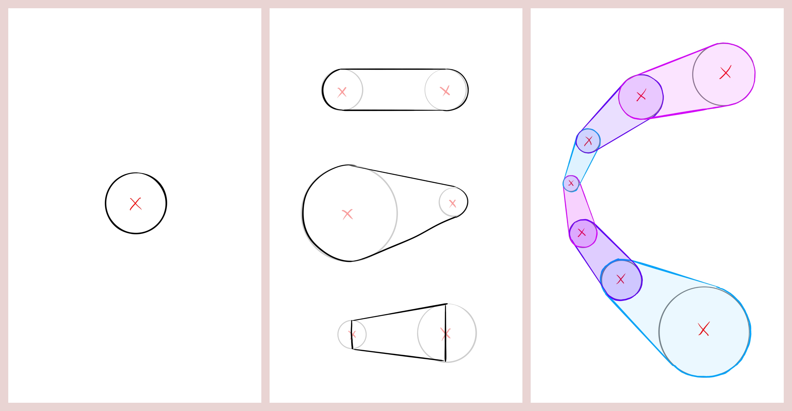

*(1) Node. (2) Variations of beams. (3) Lattice from multiple beams.*


### Implicits

Implicits describe a shape via a signed-distance function (SDF). This function states for each point in space how far it is away from the surface of the object with a sign marking the inside or outside. Implicits are mainly useful for simple shapes and infill patterns such as gyroids. There are presets for common examples, but you can create a new implicit class that encapsulates your custom SDF. In contrary to the other geometry types, implicits are derived from an interface called `IImplicit`. Some SDFs can be periodic or un-bound. When rendering an inplicit into a voxelfield, your therefore need to either specifiy a bounding box or a bounding voxelfield to intersect with. This is how the code for these steps looks like:

- Use the presets to get SDFs for a sphere and a gyroid:

  ```c#
  IImplicit sdfSphere  = new ImplicitSphere(vecCentre, fRadius);
  IImplicit sdfPattern = new ImplicitPattern(ImplicitPattern.EPattern.GYROID, 15, 3);
  ```

- Render an implicit into a new voxel field:

  ```c#
  BBox3 oBBox = new BBox3(
    1.5f * new Vector3(-fRadius, -fRadius, -fRadius), 
    1.5f * new Vector3(fRadius, fRadius, fRadius));
  Voxels voxSphere = new Voxels(sdfSphere, oBBox);
  ```

- Intersect a voxelfield with a 3D pattern (infill):

  ```c#
  Voxels voxGyroidSphere = Sh.voxIntersectImplicit(voxSphere, sdfPattern);
  ```

- Create a custom SDF using a class that implements the implicit interface:

  ```c#
  public class ImplicitSphere : IImplicit
  {
    protected Vector3	m_vecCentre;
    protected float		m_fRadius;
  
    public ImplicitSphere(Vector3 vecCentre, float fRadius)
    {
      m_vecCentre = vecCentre;
      m_fRadius	= fRadius;
    }
  
    public float fSignedDistance(in Vector3 vecPt)
    {
      return (vecPt - m_vecCentre).Length() - m_fRadius;
    }
  }
  ```


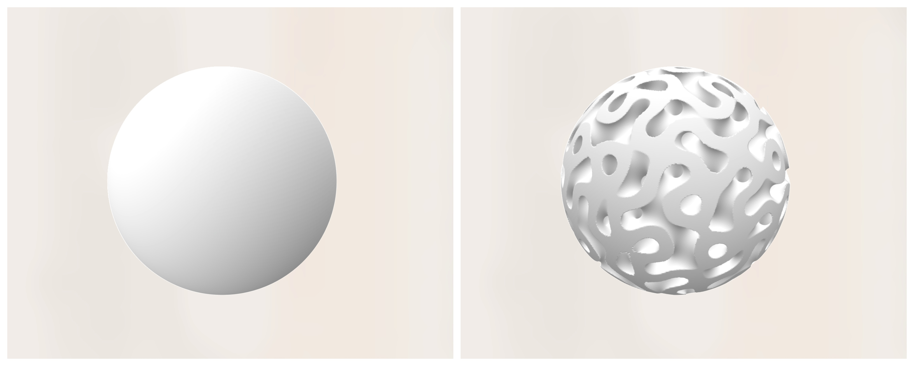

*(1) Sphere from GImplicit. (2) Gyroid-filled Sphere.*


### Base Shapes

Base Shapes build the core of the Shape Kernel. They are geometric primitives that help you to generate more sophisticated shapes without interacting with the geometry data types directly. In traditional Computer-Aided Design (CAD), there are primitives like cylinders, spheres and boxes with dimensions that can be parametrised. The Shape Kernel uses primitives that are similar on their most basic level, but can be advanced in terms of complexity through **Frames** , **Modulations** and **Transformations**. In oder to understand how Base Shapes are used, we will introduce these three concepts first.


## Local Frames and Frames

A **Local Frame** is a coordinate system with a position and three orthogonal axes (local x, local y and local z) that can be freely placed and rotated in space. Objects can be constructed with respect to this relative frame of reference rather than the absolute coordinate system. All Base Shapes are constructed with respect to a local frame, which makes it easy to orient and place them in space without having to change their internal construction logic. 


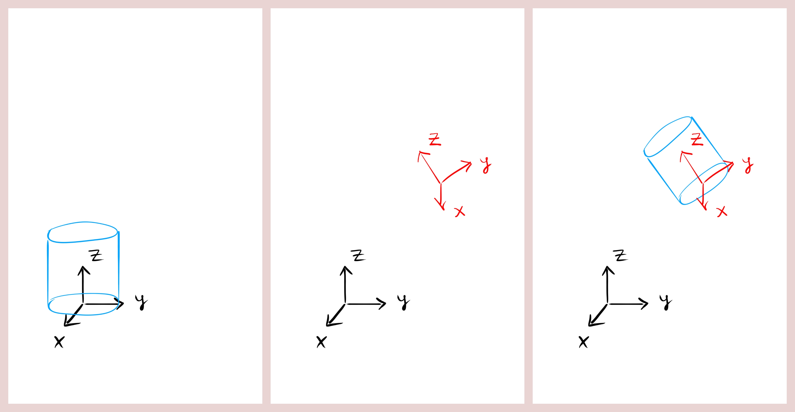

*(1) Cylinder constructed and placed with respect to the origin of the carthesian coordinate system ("absolute").*

*(2) Local Frame (red).*

*(3) Cylinder constructed and placed with respect to the Local Frame ("relative").*


This is how you can create a new Local Frame:

- Instantiate a Local Frame that is identical with the absolute coordinate system:

  ```c#
  LocalFrame oFrame = new LocalFrame();
  ```

- Instantiate a Local Frame that is translated against the absolute coordinate system:

  ```c#
  LocalFrame oFrame = new LocalFrame(new Vector3(2, 5, -3));
  ```

- Instantiate a Local Frame that has a custom local z direction:

  ```c#
  LocalFrame oFrame = new LocalFrame(new Vector3(2, 5, -3), new Vector3(0, 0, 1));
  LocalFrame oFrame = new LocalFrame(new Vector3(2, 5, -3), new Vector3(1, 0, 0));
  LocalFrame oFrame = new LocalFrame(new Vector3(2, 5, -3), new Vector3(1, 5, -2));
  ```

- Instantiate a Local Frame that has a custom local z and local x direction:

  ```c#
  LocalFrame oFrame = new LocalFrame(new Vector3(2, 5, -3), new Vector3(0, 0, 1), new Vector3(1, 0, 0));
  LocalFrame oFrame = new LocalFrame(new Vector3(2, 5, -3), new Vector3(0, 0, 1), new Vector3(0, 1, 0));
  LocalFrame oFrame = new LocalFrame(new Vector3(2, 5, -3), new Vector3(0, 0, 1), new Vector3(3, -5, 0));
  ```

- Query a Local Frame object for its position and local directions:

  ```c#
  Vector3 vecPos    = oFrame.vecGetPosition();
  Vector3 vecLocalX = oFrame.vecGetLocalX();
  Vector3 vecLocalY = oFrame.vecGetLocalY();
  Vector3 vecLocalZ = oFrame.vecGetLocalZ();
  ```

  

**Frames** are sequences of local frames along a spline in space. They are used to construct pipe-like Base Shapes that do not necessarily have a constant orientation, but evolve / twist along their spines. Within Frames, the local z of each local frame runs tangentially in the direction of the spline. The local x and local y directions lie in a perpendicular plane to that, however there remains a degree of freedom in what way these two vectors are rotated within that plane.


*(1) Cylinder constructed and placed with respect to the Local Frame ("no spine").*

*(2) Points on a 3D spline*.

*(3) Frames are the result of populating such a spline with a sequence of local frames. Frames are then used to construct a "spined" Base Shape.*


There are multiple options (application-specific) of how local x and local y can be oriented perpendicular to a given location along the spline. If a constant vector is defined as a target, all local x along the spline will be rotated such that they maximize their alignment with the target direction (only when the tangential direction of the spline falls together with the target direction, an deviating / smoothing strategy must be used). Once local z and local x are defined, local y follows automatically to complete a right-hand system. In addition to that, frames can also be designed to target a radial or spherial direction (which is not constant, but depends on the current position in space). You will find radially-targeted frames useful for many engineering objects that have a rotational symmetry, such as pipes, rocket chambers, motors... 

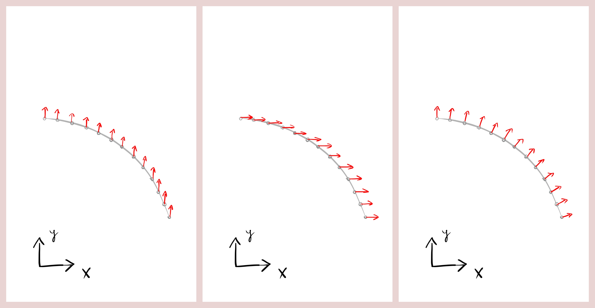

*(1) Top view of a spline with significant z-range (that is not visible, but imagine the points as shifted stacks in z) and Y-targeted frames. All local x of all local frames along the spline are rotated to maximise alignment with the absolute y-axis. Note that only local x vectors are shown. Local z vectors are aligned with the spline tangents at each point.* 

*(2) X-targeted frames.*

*(3) Radially-targeted frames.*


Here are some examples of how to get started with Frames:

- Create Y-targeted Frames from a spline:

  ```c#
  ISpline oSpline = new BasicSpline();
  Frames aFrames  = new Frames(oSpine.aGetPoints(), Vector3.UnitY);
  ```

- Create radially-targeted Frames from a spline:

  ```c#
  Frames aFrames = new Frames(oSpine.aGetPoints(), Frames.EFrameType.CYLINDRICAL);
  ```

- Create Frames along a straight line with constant target directions:

  ```c#
  LocalFrame oConstFrame = new LocalFrame(
    new Vector3(10, 30, 30), 
    new Vector3(0, 1, 0), 
    new Vector3(0, 0, 1));
  Frames aFrames = new Frames(100, oConstFrame);
  ```

- Query a Local Frame along the spine length:

  ```c#
  float fLengthRatio = 0.2f;
  LocalFrame oFrame = aFrames.oGetLocalFrame(fLengthRatio);
  ```

  

Some Base Shapes can only have a Local Frame, while other Base Shapes have the option to have Frames ("spined").


## Line and Surface Modulations

All shapes feature a number of surfaces. A surface can be a 3D object, but it is described via two length dimensions. Think of each surface as a normalised 2D interval from 0 to 1. 

A **Line Modulation** is an object that tells a Base Shape how one of its specific dimensions (e.g. the width of a box) evolves across another dimension of a surface (e.g. along its length). Such a functional dependency can be created through different kinds of inputs as shown in the image below.

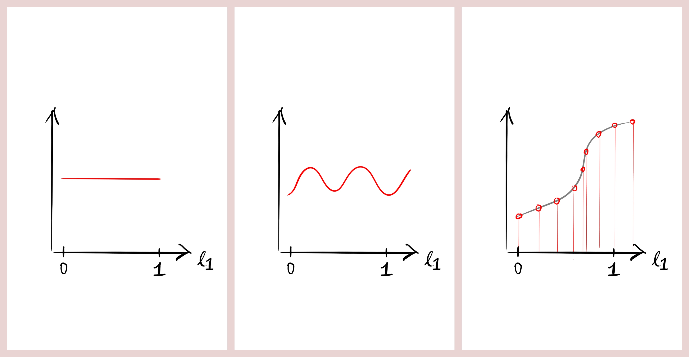

*(1) Constant Line Modulation that always returns the same value for each point between 0 and 1.* 

*(2) Functional Line Modulation that calculates the value based on a (continuous) delegate function, e.g. a sine wave.*

*(3) Line Modulation that interpolates between a discrete point list (e.g. a spline or measurement series).*


Here are some examples of how to create a new Line Modulation object:

- Instantiate a new Line Modulation based on a constant value:

  ```c#
  LineModulation oLineModulation = new LineModulation(5);
  ```

- Instantiate a new Line Modulation from a function:

  ```c#
  public float fGetWidthOverLengthRatio(float fLengthRatio)
  {
    float fWidth = 30 + 20 * fLengthRatio;
    return fWidth;
  }
  LineModulation oLineModulation = new LineModulation(fGetWidthOverLengthRatio);
  ```

- Instantiate a new Line Modulation from a discrete point list:

  ```c#
  LineModulation oLineModulation = new LineModulation(
    aBSplinePoints,
    LineModulation.ECoord.X,
    LineModulation.ECoord.Z);
  ```

- Query a Line Modulation object for the value at a given ratio:

  ```c#
  float fValue = oLineModulation.fGetModulation(fRatio);
  ```

  

A **Surface Modulation** is the 2D equivalent to the Line Modulation. It tells a Base Shape how one dimension (e.g. the radius of a cylinder) evolves across the two dimensions of a surface (e.g. the mantle surface of a cylinder has a polar and a length dimension). 

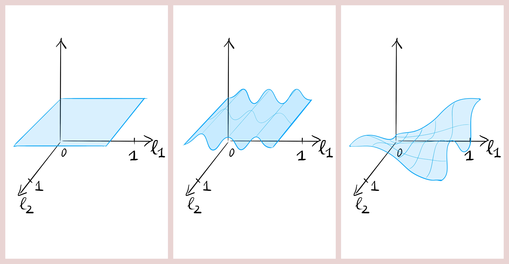

*(1) Constant Surface Modulation that always returns the same value for each two points between 0 and 1.* 

*(2) 1D functional Surface Modulation that is derived from a Line Modulation.*

*(3)  Functional Surface Modulation that calculates the value based on a (continuous) delegate function, e.g. different sine waves in each dimension .*


Modulation objects are intended to funnel all these different ways of describing a surface into a Base Shape. There are various types of Base Shapes. Depending on their respective topology, some use multiple Line Modulations, some use a Surface Modulation and some use a combination of the two. A modulation is a deformation that is related to the local, shape-specific coordinate system(s). Here are some examples of how to create a new Surface Modulation object:

- Instantiate a new Surface Modulation based on a constant value:

  ```c#
  SurfaceModulation oSurfaceModulation = new SurfaceModulation(5);
  ```

- Instantiate a new Surface Modulation from a function:

  ```c#
  public float fGetRadiusOverPhiLengthRatio(float fPhi, float fLengthRatio)
  {
     float fRadius = 30 + 20 * fLengthRatio + 5f * MathF.Cos(6f * fPhi);
     return fRadius;
  }
  SurfaceModulation oSurfaceModulation = new SurfaceModulation(fGetRadiusOverPhiLengthRatio);
  ```

- Instantiate a new Surface Modulation from a Line Modulation:

  ```c#
  SurfaceModulation oSurfModulation = new SurfaceModulation(oLineModulation);
  SurfaceModulation oSurfModulation = new SurfaceModulation(oLineModulation, SurfaceModulation.ELine.FIRST);
  SurfaceModulation oSurfModulation = new SurfaceModulation(oLineModulation, SurfaceModulation.ELine.SECOND);
  ```
  
- Query a Line Modulation object for the value at a given ratio:

  ```c#
  float fValue = oSurfaceModulation.fGetModulation(fRatio1, fRatio2);
  ```


## Base Shapes

A **Base Sphere** has a Local Frame. Its radius can be described through a Surface Modulation across phi and theta (polar and azimuthal angles).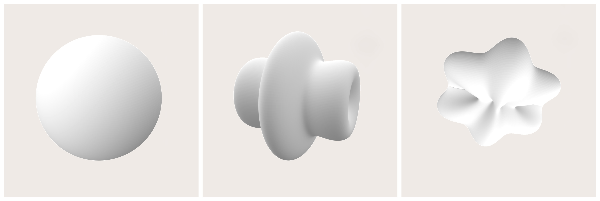

A **Base Lens** has a Local Frame. It has a constant inner and outer radius. The height distribution for the upper and the lower surface can be described via two independant Surface Modulations across phi (polar angle) and the radius ratio.

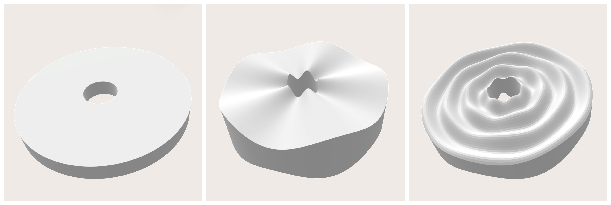

A **Base Ring** has a LocalFrame. It has a constant ring radius. The ring surface can be described via a Surface Modulation across alpha (global polar angle) and phi (local polar angle).

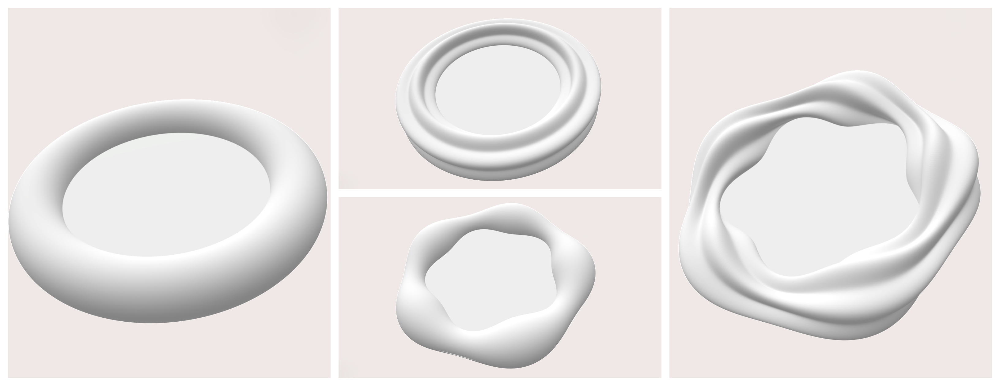

A **Base Box** can either have a Local Frame or Frames. The width and depth can be described via two independant Line Modulations across the (spine) length ratio.


A **Base Cylinder** can either have a Local Frame or Frames. The radius can be described via a Surface Modulation across the (spine) length ratio.

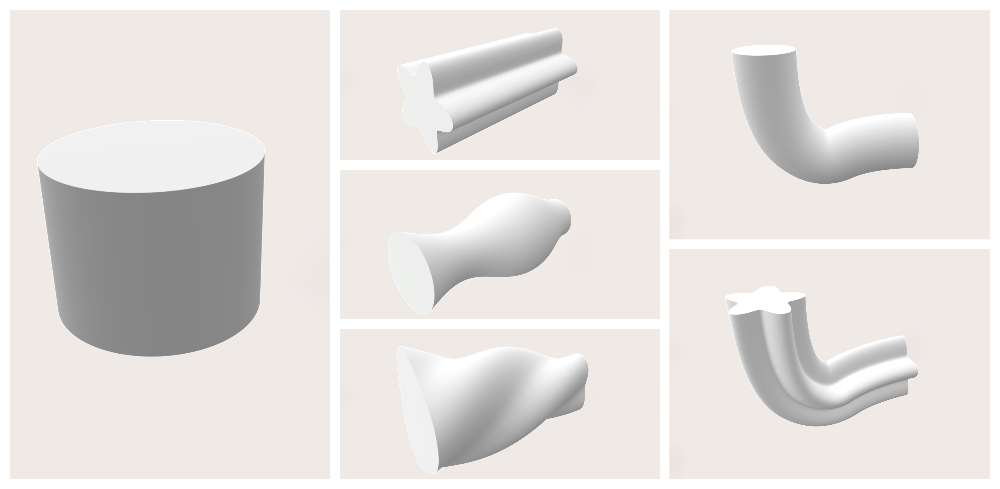

A **Base Pipe** can either have a Local Frame or Frames. The inner radius and the outer radius can be described via two independant Surface Modulations across the (spine) length ratio.


A **Base Pipe Segment** can either have a Local Frame or Frames. The inner radius and the outer radius can be described via two independant Surface Modulations across the (spine) length ratio. In addition to that, it lives on a polar section of a full circle. This section is described through two independant Line Modulations that can either define its start and end polar angles or its mid and (symmetrical) range polar angles across the (spine) length ratio. 

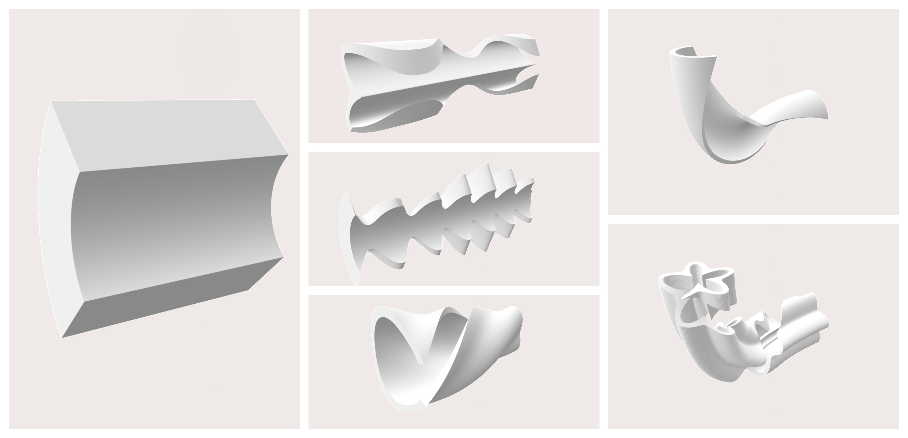

A **Lattice Pipe** can either have a Local Frame or Frames. The radius can be described via a Line Modulation across the (spine) length ratio. This Base Shape explicitly uses Lattices as the underlaying geometry data type. Since all lattices have a round cross-section, the radius can only be modulated across the length, but not across phi (polar angle).


A **Lattice Manifold** can either have a Local Frame or Frames. The radius can be described via a Line Modulation across the (spine) length ratio. An overhang angle can be defined to dictate the teardrop-shape extension in positive z-direction. The extension can also be toggled for the negative z-direction, resulting in a rhombical cross-section.

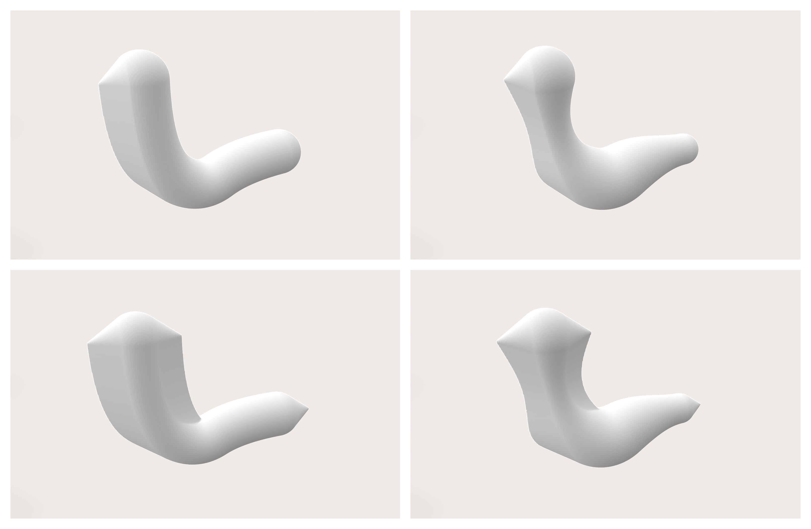

### 	

### Transformations

In addition to Modulations and Frames, all Base Shapes have the option to pass a transformation as a delegate function. Such transformations have the format of `Vector3 vecGetTransformedPoint(Vector3 vecPt)`. 

In contrary to a modulation, a transformation is a deformation that is based on the absolute coordinate system. This way, a Base Shape can be manipulated independently of its topology. For all lattice-based Base Shapes, the specified transformation will apply to each point on the spine. For all other Base Shapes, the tranformation will apply to each point on the surface. Here are some examples:

- Global (linear) transformation of the entire shape:

  ```c#
  public Vector3 vecTransformPoint(Vector3 vecPt)
  {
    Vector3 vecNewPt = vecPt + new Vector3(30, 0, 50);
    return vecNewPt;
  }
  ```

- Local (non-linear) transformation:

  ```c#
  public Vector3 vecTransformPoint(Vector3 vecPt)
  {
    float fRadius = 50 + 20 * vecPt.Z;
    float fBogen  = 2f * MathF.PI * fRadius;
    float fAlpha  = 50f / fBogen * (vecPt.X);
    float fNewZ   = 1.0f * vecPt.Y;
    float fNewX   = fRadius * MathF.Cos(fAlpha);
    float fNewY   = fRadius * MathF.Sin(fAlpha);
    Vector3 vecNewPt = new Vector3(fNewX, fNewY, fNewZ);
    return vecNewPt;
  }
  ```


## Getting Started

Here is the summary of how you can operate a Base Shape:

- Instantiate a Base Shape with a Local Frame:

  ```c#
  BaseSphere oShape   = new BaseSphere(oFrame, 10);
  BaseCylinder oShape = new BaseCylinder(oFrame, 50, 30);
  ```

- Instantiate a Base Shape with Frames:

  ```c#
  BaseCylinder oShape = new BaseCylinder(aFrames, 30);
  ```

- Set a Line Modulation:

  ```c#
  oShape.SetDepth(oLineModulation);
  oShape.SetDepth(new LineModulation(10));
  oShape.SetWidth(new LineModulation(fGetWidthOverLengthRatio));
  oShape.SetWidth(new LineModulation(aBSplinePoints, LineModulation.ECoord.X, LineModulation.ECoord.Z));
  ```

- Set a Surface Modulation:

  ```c#
  oShape.SetRadius(oSurfaceModulation);
  oShape.SetRadius(new SurfaceModulation(20));
  oShape.SetRadius(new SurfaceModulation(fGetRadiusOverPhiLengthRatio));
  oShape.SetRadius(new SurfaceModulation(oLineModulation));
  ```

- Set a Transformation:

  ```c#
  oShape.SetTransformation(vecGetTransformedPoint);
  ```

- Update the resolution / surface quality:

  ```c#
  oShape.SetLengthSteps(500);
  oShape.SetRadialSteps(500);
  oShape.SetPolarSteps(500);
  ```

- Render Base Shape into voxelfield:

  ```c#
  Voxels oVoxels = oShape.voxConstruct();
  ```


There are many more examples provided in source-code form in the **Examples** folder. The best way to get started is to tinker with simple shapes and enrich them with complexity step-by-step. Head over to the [introduction of setting up the ShapeKernel library and running your first example task!](README-GettingStarted.md)

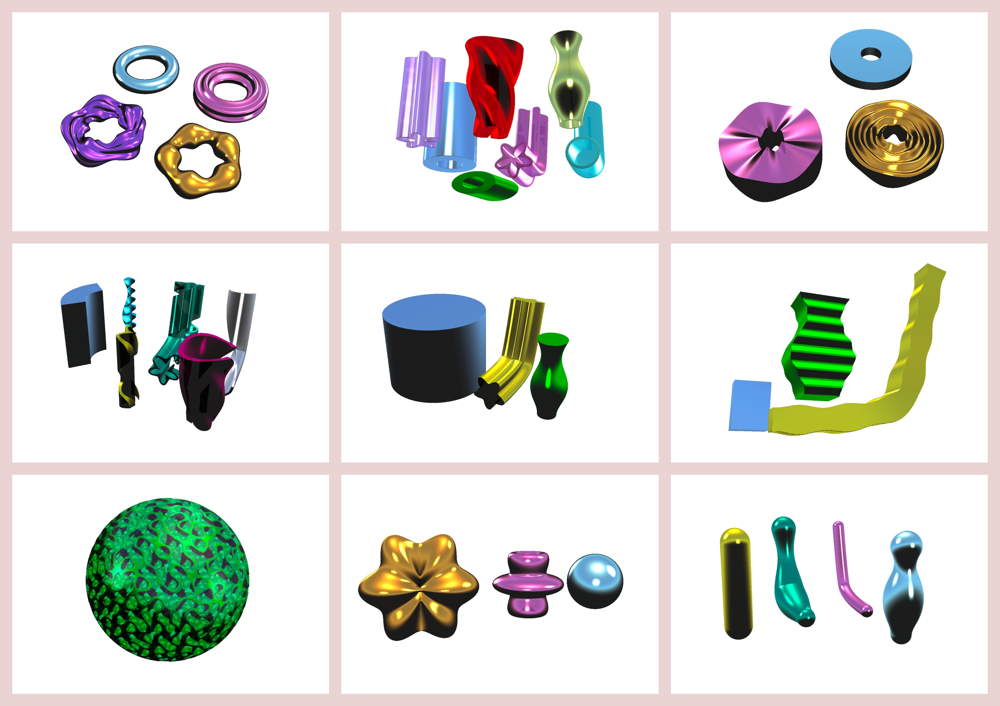

*(1) Examples of different BaseShapes.*
